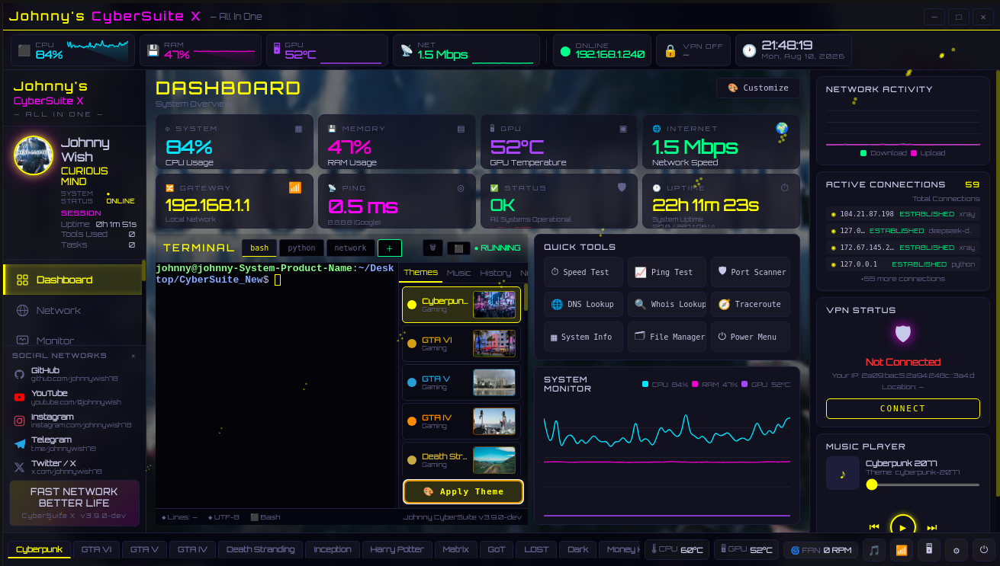

# Johnny CyberSuite X

<p align="center">
  <strong>CURIOUS MIND</strong><br>
  Explore. Understand. Build. Secure.
</p>


---

## 🚀 Overview

**Johnny CyberSuite X** is a modern, modular cybersecurity and network toolkit built around an Electron desktop interface and a Python/FastAPI backend.

It brings network analysis, system monitoring, VPN diagnostics, terminal utilities, runtime session information, and security-oriented tools together inside a unified Linux desktop environment.

<p align="center">
  
</p>

> **Status:** Development
> **Version:** 3.9.0
> **Stable checkpoint:** `v3.9.0-stable`
> **Development branch:** `develop-v3.9`

---

## ✨ Features

- 🖥️ Electron desktop interface
- 🌐 Network Center
- 📡 Live network diagnostics
- 🛡️ VPN status and diagnostics
- 📊 System and hardware monitoring
- 🖥️ Integrated terminal
- 👤 Runtime profile and session information
- ⏱️ Runtime uptime tracking
- 🧰 Tools-used and task tracking
- 🎨 Multiple visual themes
- ⚡ Cyberpunk-inspired neon interface
- 🔌 Modular Python/FastAPI backend
- 🧪 Automated test suite
- 📦 Linux AppImage packaging
- 📦 Debian package (`.deb`) packaging
- 🤖 Foundation for future AI and security modules

---

## 🖥️ Current Interface

The current `develop-v3.9` development line includes:

- Dashboard
- Network Center
- System Monitor
- VPN Status
- Profile and session information
- Runtime uptime
- Tools-used tracking
- Task tracking
- Multiple visual themes
- Responsive themed layout
- Cyberpunk / neon visual design

### Profile Identity

The current profile identity is:

**CURIOUS MIND**

---

## 🏗️ Architecture

```text
Johnny CyberSuite X
│
├── desktop/
│   ├── main.js
│   ├── preload.js
│   └── renderer/
│       ├── index.html
│       ├── style.css
│       └── app.js
│
├── backend/
│   ├── FastAPI application
│   └── network/system services
│
├── assets/
├── build/
├── tests/
├── docs/
│   └── images/
├── .github/
│   └── workflows/
│
├── package.json
├── package-lock.json
├── VERSION
├── version.json
├── start.sh
└── README.md
